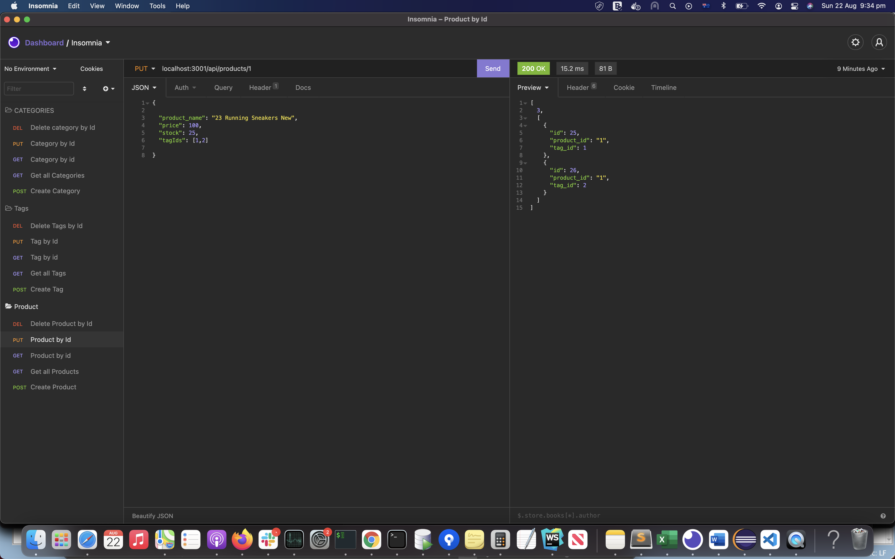

# E-Commerece Website Backend


## Description
This is the backend part of the E-commerce website. Express.js is used for the server and MySQL for the database along with Sequelize as the ORM to the SQL models .


## User Story

```md
AS A manager at an internet retail company
I WANT a back end for my e-commerce website that uses the latest technologies
SO THAT my company can compete with other e-commerce companies
```
## Installation
- Both Node.js and MySQL must be installed on your computer.
- Clone the repo by copying and pasting in your command line: 
  - `git clone https://github.com/mayuripendyala/e-commerce-backend.git`
- Navigate to the root directory and run: 
    - `npm install`
    - update the username and password in (.env) file.
    - `node seeds/index.js`
    - `npm start`

## Tech Used
- Node
- Express
- MySQL
- Sequelize
- Dotenv

## Demo
View walk through video here - https://youtu.be/MaUiX6NKAMU


